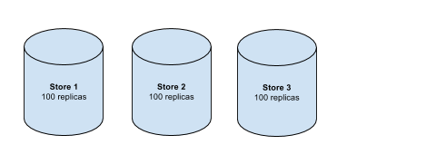
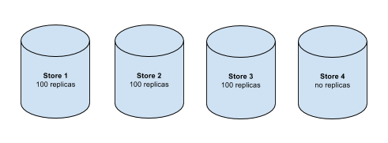
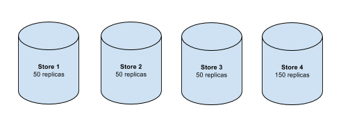

# Centralized Replica Allocation

* Feature name: Centralized Replica Allocation
* Status: STRAWMAN
* Start date: 2016-04-20
* Authors: Bram Gruneir & Cuong Do

## Current state

To allocate replicas for ranges, we currently rely on distributed [stateless
replica relocation](stateless_replica_relocation.md).

Each range leader is responsible for replica allocation decisions (adding and
removing replicas) for its respective range. This is a good, simple start.
However, it is particularly susceptible to thrashing. Because the different
range leaders distribute replicas independently, they don't necessarily converge
on a desirable distribution of replicas with a reasonable number of replication
allocations.

For example, consider the following scenario where we have 3 perfectly balanced
stores:

Let's add an empty store:

Until recently, our replica allocator had no limits for how fast rebalancing
could occur. Combined with lack of current `StoreDescriptor`s and lack of
coordination between replica allocators, an over-allocation to the new
store is likely to occur:

This over-rebalancing would continue for many cycles, often resulting in tens
of thousands of replicas adds and removes for clusters with miniscule data.

A [recent change](https://github.com/cockroachdb/cockroach/commit/c4273b9ef7f418cab2ac30a10a8707c1601e5e99)
has added a minimum delay of 65 seconds between rebalance attempts for each
node, to reduce trashing. This works well for small clusters with little data.
However, this severely slows down the process of rebalancing many replicas
in an imbalanced cluster.

## Criteria for evaluating replica allocators

Relative priorities are debatable and depend on deployment specifics, so the
following are listed in no particular order:

1. Evenly spreads data across stores
2. Evenly spreads load (normalized CPU usage) across stores
3. Minimizes thrashing (i.e. minimize inter-node network traffic)
4. Works well in both small and large clusters
5. Handles new store additions gracefully
6. Handles stores being permanently down (>= 5 minutes) gracefully
7. Handles outages of any number of nodes gracefully, as long as quorum is
   maintained.

## Possible Strategies

### Centralized Replica Allocator

One way to avoid the thrashing caused by multiple independently acting
allocators is to centralize all replica allocation. Here's an outline of a
centralized allocation strategy.

Every ~60 seconds (+/- some intentional jitter), each node calls
`Get(globalAllocatorKey)`. If `Get` returns data, we know there's already a
global allocator, so we take no action until another ~60 seconds passes.

If a node sees that `Get` returns `nil, that node does the following:

1. Call `CPut(globalAllocatorKey, expireTime, nil)`
2. If `CPut` succeeds, the node becomes the Global Allocator until the proposed
   expiration time.
3. While the node has the global allocator role, it is the only node that can
   initiate replica adds and deletes.
4. The global allocator reads `StoreDescriptor`s from the `StoreStatus` protos,
   written every 10 seconds by each node, and uses those to make a global set of
   decisions based on its heuristic or possible set of heuristics. Later, we may
   want to have different rebalancing heuristics for different deployment
   scenarios.

   The choice of heuristic is important and will be addressed in a separate RFC.

At the end of the lease term of ~60 seconds, the Global Allocator (GA) tries to
renew its lease using another `CPut`. If the `CPut` fails, the GA relinquishes
its allocation duties.

There is no limit to how long a GA can serve in the GA role. (Not sure if there
should be.)

## Enhanced Distributed Allocation

The current distributed allocator cannot rebalance quickly because of the >= 65
second rebalancing backoff. Because removing that backoff would cause excessive
allocation thrashing, we'd need to modify the `Allocator` to make faster
progress while minimizing thrashing.

Here are some potential enhancements to reduce thrashing, which would allow us
to either reduce or eliminate the allocator backoff:

* Move from using gossiped `StoreDescriptor`s (updated every 60 seconds) to
  stored `StoreStatus`es (written every 10 seconds).
* Based on the latest `StoreDescriptor`s, determine how many stores would
  likely rebalance in the next 10 seconds. Then, each of those stores rebalances
  with probability `1/(# of candidate stores)`.

  For example, suppose that we're balancing by replica count. Two stores have
  100 replicas, and one store has 0 replicas. So, there are 2 stores that are
  good candidates to move replicas from. Each of those 2 stores would have a
  `1/2` probability of starting a rebalance. We could speed this up by
  doing this virtual coin toss `N` times, where `N` is the total number of
  replicas we'd like to move to the destination store.
* Don't try to rebalance until the previous `ChangeReplicas` call has finished
  adding the replica to the new store. Since it takes time to copy 64MB ranges
  around, this naturally limits the frequency of rebalances.
* For each decision to rebalance, an `Allocator` could issue RPCs to
  synchronously send and receive up-to-date `StoreDescriptors` for all selected
  canddiate stores. Both the source and destination `Allocator`s would update
  their respective cached `StoreDescriptors`. This reduces thrashing caused by
  acting on outdated information.

Note that there is overlap between some of these enhancements, so it only makes
sense to implement a subset of them.
